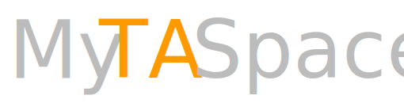

# Laurier CP317 MyTASpace <br/>
Laurier CP317 Spring 2019 MyTASpace<br/>
This is an app built for changing grades on MyLearningSpace, the learning management system used by Wilfrid Laurier University on your phone.<br/>
Project uses [Ionic Framework](https://ionicframework.com).<br/>
Project is maintained for iOS and Android only. 
***

## Environment Setup
[Git](https://git-scm.com/downloads) - You are on Github. I'd assume you know what Git is.</br>

[Node.js 10.16.0 LTS](https://nodejs.org/en/) - This is requested by Ionic CLI and the underlying structure of this project.</br>
```shell
# determine node version
node --version
```
[Visual Studio Code](https://code.visualstudio.com/) (recommanded) or any other IDE for web development.

We found VSCode to be the best fit for this project despite its lack of plugins for `Cordova`, one of the underlying framework of the project. Then again we are just doing generic web development so it's good enough. You have all the options from `WebStorm` to `Notepad++`.

You will also need to install Ionic CLI and Cordova CLI:
```shell
npm install -g ionic
npm install -g cordova
```
If installation fail, try sudoing.

Also, make sure you have `Android Studio` or `XCode` installed on your machine for Android or iOS building respectively.

## Usage

First, get a copy of this repo:

```shell
git clone https://github.com/SleevefishYoo/LaurierCP317MyTASpace.git
```

then change current directory to the project root:
```shell
cd LaurierCP317MyTASpace/
```
then install all the package used by this project:
```shell
npm i
```
while the packages are being added to the project folder, create a new file called `cred.json` under folder `src/app/` with the following format:
```json
{
    "Brightspace": { 
        "appID": "your app ID acquired from your Admin or D2L",
        "appKey": "your app key", 
        "Host": "the address of your target Brightspace instance without 'http(s)://' at the front (e.g. 'devcop.brightspace.com')",
        "Callback" : "the callback url you provided when requesting ID and Key"
    }, 
    "Session": {
        "userID": "userID the LMS instance provided when redirecting you to the callback URL", 
        "userKey": "userKey the LMS instance provided when redirecting you to the callback URL",
        "CallBackURLWithParams": "the URL LMS redirected you to after successful login", 
        "skew": "haven't seen any value other than 0. From the docs, this is the number indicating the time difference between your app and the target LNS instance. Chnage this number accordingly."
    }
}
```

In which `"Brightspace"` is used by master branch for actual login, and `"Session"` is optional. It is used for DemoAPP branch to login directly without needing to type in username and password.

By now your `npm i` should have finished running. If there's no errors, you are ready to make changes and your IDE's IntelliSense or whatever should start working normally.
***
## Building & running

Since `Cordova/inappbrowser` is not available in browser so login flow could not be completed, rendering `Live Preview` useless for `master` branch. Only test `master`  on a emulator or a physical device.

### Live Preview
Make sure your `src/app/cred.json` is filled out correctly, then open up a terminal, `cd` to project root, then run:
```shell
ionic serve
```
Wait for the build to finish, then you should see your browser poping up and the app is running in your browser.

This is a `Live preview`, which means that not all function works inside the browser, in fact, all Cordova functions are not working, resulting some pages not opening, e.g. `About` in `Settings`. 

Code changes are reflected in the `live preview` when `Ionic CLI` detects any file change in the project directory. So every time you change and then save a file, your `live preview` should refresh with new changes applied automatically.
### Emulators and physical devices
#### Android
First, make sure you have your Android Studio setup currectly with SDK for `Android O`, `platform-tools` installed and added to your `PATH`. 

To verify your `platform-tools`, open a terminal window and type `adb devices`. If this shows up:
```shell
List of devices attached
```
Then you are good to go. 

Now, you may want to connect your Android device to your computer if you want to test the app on a hardware device. If you do not wish to do so, you should setup at least one emulator in `Android Studio` befor you proceed.

If you have everything setup, `cd` to project root, type:
```shell
ionic cordova run android
```
To build and run the project. If you have a physical device plugged in and is recognized by adb, then the app will be installed and launched on your physical device. If not, an emulator you have setup in `Android Studio` should boot up and the app will be installed and launched on there.

#### iOS
 **Building, running iOS apps are only available on MacOS**.

First, make sure you have your `XCode` setup.
Then in the terminal at the project root, type:

```shell
ionic cordova build ios
```

Once the command has finished, head to `platforms/ios/`, open `MyTASpace.xcodeproj`.

Then click on the <button class = "markdown-button" type="introbutton">▶</button> at the top left of the XCode window.

***
## Extensibility

### Function Extensibility

The app's code is pretty moldular, so adding new function should be quite easy. Brightspace and login-related code are in `Brightspace Service`, Updating displayed lists, pages and stuff are in `Organization Service`, Button presses are handled in individual page's ts files. 

**We would happily take PRs.**

**Sorry but we are not able to provide any App ID and Key, even for testing propuses. Ask us about how to get one.**

### Platform Extensibility
Since the app uses Ionic which uses Cordova, this app could theoritically run on a lot of platforms that we do not officially support such as `MacOS`, `Windows`, even as `Electron` app. 

But not without hiccups. In our testing, the main plugin we uses in our login flow, `Cordova/inappbrowser`, does not work under `MacOS`, Works differently in `Electron` in a way that prevents us to grab the session information form the callback URL, The app flat-out won't open on `Windows`. The inconsistancy of these plugins' behaviour on different platforms is the main reason we **do not** officially support these platforms right now.

On the other hand, most of other plugins works exactly the same under these platforms. So we are not ruling out the possibilities to support those platforms in the future because, I could be astronomically wrong, but adapting current code to one of those platforms showld require a lot less effort than to develop an app on that platform from the ground up.

**Currently, we are not planning on expanding our support to any other platform. We would happily take any PR but our code is not optimized for that. You have been warned.**
